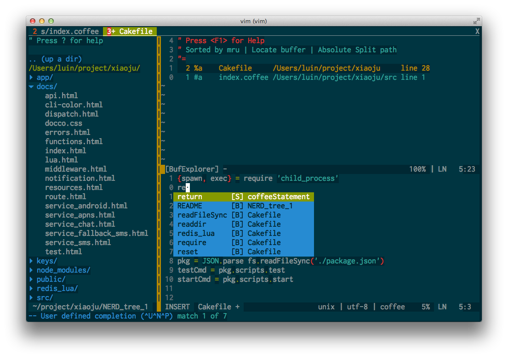

## About
My various dotfiles (tested to work on OS X).



## How to use
1. Setup [oh-my-zsh](https://github.com/robbyrussell/oh-my-zsh/) (Optional):

	```
	$ wget --no-check-certificate https://github.com/robbyrussell/oh-my-zsh/raw/master/tools/install.sh -O - | sh
	```

2. Install my dotfiles:

	```
	$ git clone https://github.com/luin/dotfiles.git
	$ cd dotfiles && make install
	```

3. Setup [Vundle](http://github.com/gmarik/vundle)

     ```
     $ git clone https://github.com/gmarik/vundle.git ~/.vim/bundle/vundle
     ```


4. Install Vim bundles:

	Launch vim, run :BundleInstall

5. Enable persistent undo:

	Make sure the directory "~/.vim/undo" is existed

## FAQ
Q1: I got the following errors when I use `sudo vim filename`:

	Error detected while processing /Users/username/.vim/bundle/neocomplcache/plugin/neocomplcache.vim:
	line   37:
	"sudo vim" and $HOME is not same to /root are detected.Please use sudo.vim plugin instead of sudo command or set always_set_home in sudoers.

A1: You should always use `sudoedit filename` or `sudo -e filename` instead. See more: [http://superuser.com/questions/23428/vim-sudo-vim-bad-idea](http://superuser.com/questions/23428/vim-sudo-vim-bad-idea)

